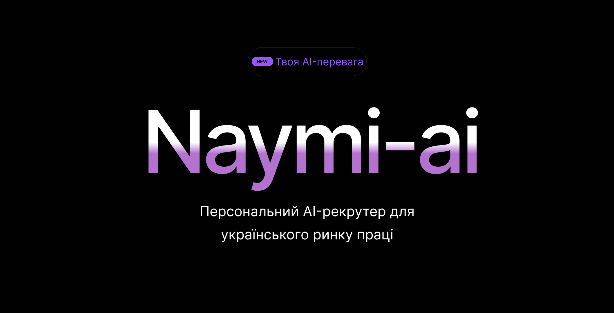
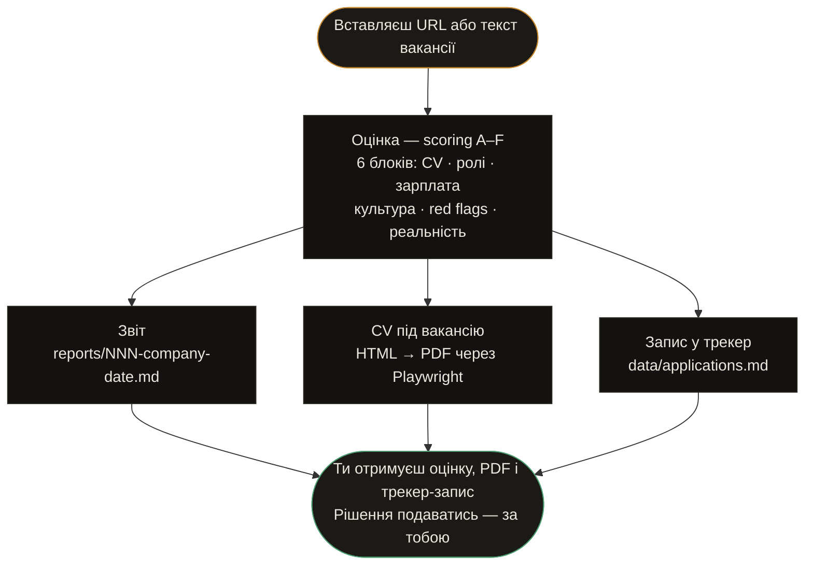

<!--
  ╔═══════════════════════════════════════════════╗
  ║              NAYMI AI  ·  README              ║
  ╚═══════════════════════════════════════════════╝
-->

<div align="center">



# 🤖 Naymi AI

### Персональний AI-рекрутер для українського ринку праці

*Побудовано на [Claude Code](https://claude.ai/code) · Працює у вашому терміналі*

[](LICENSE)
[](https://nodejs.org)
[](https://playwright.dev)
[](portals.yml)
[](https://claude.ai)

[🇺🇦 Українська](#) · [🇷🇺 Русский](README.ru.md) · [🇬🇧 English](README.en.md)

</div>

---

## Що це таке

**Naymi AI** — агент командного рядка, який бере на себе рутину пошуку роботи:

- вставив URL вакансії → отримав оцінку A–F, ATS-оптимізоване CV і запис у трекер
- ніяких нескінченних таблиць у Notion, ніяких одноманітних резюме для кожної компанії
- повний цикл: **скан порталів → оцінка → PDF → заявка → follow-up**

Заточений під **Djinni, DOU, Work.ua, Robota.ua**. Документи генерує мовою вакансії: **🇺🇦 / 🇷🇺 / 🇬🇧**.

> **Принцип:** 5 точних заявок краще, ніж 50 масових. Система відраджує від слабких матчів — і підсилює сильні.

---

## Можливості

<table>
<tr>
<td width="50%">

**📋 Оцінка вакансій**
Система скорингу 1–5 за 6 блоками: збіг з CV, ролі, зарплата, культура, red flags, реалістичність. Оцінка < 4.0 — агент рекомендує не подаватись.

</td>
<td width="50%">

**📄 Генерація CV**
ATS-оптимізований PDF під конкретну вакансію. Автоматично визначає мову JD — генерує українською, російською або англійською.

</td>
</tr>
<tr>
<td>

**🔍 Сканування порталів**
Zero-token сканер через API Djinni / DOU / Work.ua / Robota.ua. Дедуплікація, фільтрація по ключових словах, тільки нові вакансії.

</td>
<td>

**📊 Трекер заявок**
Markdown-трекер зі статусами: Evaluated → Applied → Interview → Offer / Rejected. Повний аудит-лог кожної заявки.

</td>
</tr>
<tr>
<td>

**🔗 LinkedIn аутрич**
Знаходить конкретну людину в компанії + генерує персоналізоване повідомлення. Не шаблон — справжній LinkedIn power move.

</td>
<td>

**📅 Follow-up кадан**
Автоматично відстежує коли треба написати після відправки. Генерує чернетки — коротко, без «просто нагадую».

</td>
</tr>
<tr>
<td>

**🧠 Аналіз відмов**
Виявляє паттерни: які компанії, ролі, стек — дають відмови. Дозволяє коригувати стратегію на основі даних.

</td>
<td>

**🎯 Prep до співбесіди**
STAR+R-сторі, intel по компанії, типові запитання для ролі. Все в одному файлі перед розмовою.

</td>
</tr>
</table>

---

## Швидкий старт

```bash
# 1. Клонувати
git clone https://github.com/YOUR_USERNAME/naymi-ai
cd naymi-ai

# 2. Встановити залежності
npm install
npx playwright install chromium

# 3. Запустити Setup Wizard — налаштувати профіль через браузер
npm run setup

# 4. Відкрити в Claude Code або OpenCode
claude .      # або: opencode
```

**Потрібно:** [Claude Code](https://claude.ai/code) або [OpenCode](https://opencode.ai) — агент живе в них.

---

## Веб-налаштування

```bash
npm run setup
```

Відкриває `http://localhost:3737` — веб-інтерфейс для налаштування проєкту без ручного редагування YAML:

| Крок | Що налаштовується |
|------|------------------|
| 1 — Профіль | Ім'я, email, телефон, місто, LinkedIn, заголовок |
| 2 — Ролі | Цільові ролі, зарплата, формат роботи |
| 3 — Мова | Мова агента, мова CV, логіка JD output |
| 4 — Портали | Ключові слова для сканера вакансій |

Зберігає прямо в `config/profile.yml` і `portals.yml`.

---

## Як це працює



---

## Команди

```
/ai-recruiter                 → показати меню команд

/ai-recruiter {URL або JD}    → авто-пайплайн (оцінка + звіт + PDF + трекер)
/ai-recruiter pipeline        → обробити чергу URL з data/pipeline.md
/ai-recruiter scan            → знайти нові вакансії на порталах
/ai-recruiter tracker         → огляд статусу всіх заявок

/ai-recruiter oferta          → тільки оцінка (без PDF)
/ai-recruiter ofertas         → порівняти і ранжувати кілька вакансій
/ai-recruiter pdf             → тільки PDF, ATS-оптимізоване CV
/ai-recruiter contacto        → LinkedIn аутрич: контакт + повідомлення
/ai-recruiter deep            → глибоке дослідження компанії
/ai-recruiter followup        → трекер follow-up кадансу
/ai-recruiter patterns        → аналіз паттернів відмов
/ai-recruiter training        → оцінити курс або сертифікат
/ai-recruiter project         → оцінити ідею портфоліо-проєкту
```

---

## Налаштування

### 1. Твоє CV

Помісти CV у файл `cv.md` у корені — це канонічне джерело. Агент читає звідси при кожній генерації.

Якщо немає — просто скажи агенту під час onboarding: вставте текст, дайте LinkedIn-посилання, або розкажіть про досвід. Агент сформує CV сам.

### 2. Профіль

Скопіюй `config/profile.example.yml` → `config/profile.yml`:

```yaml
candidate:
  name: "Ім'я Прізвище"
  email: "email@example.com"
  phone: "+380XXXXXXXXX"
  location: "Київ, Україна"

targets:
  roles:
    - "AI Agent Developer"
    - "AI Solutions Specialist"
  salary:
    min: 1500
    target: 2500
    max: 4000
    currency: "USD"

language:
  agent: "uk"           # мова відповідей: uk | ru | en
  cv_default: "uk"      # мова CV за замовчуванням
  jd_output: "match_jd" # або "cv_default"
```

### 3. Портали і ключові слова

`portals.yml` вже налаштований під Djinni, DOU, Work.ua, Robota.ua. Відредагуй ключові слова під свої ролі.

---

## Система оцінки

Кожна вакансія отримує оцінку **1.0–5.0** за шістьма блоками:

| Блок | Що оцінюється |
|:----:|--------------|
| **A** | Збіг з CV та навичками |
| **B** | Відповідність цільовим ролям (North Star) |
| **C** | Зарплата vs ринок |
| **D** | Культура, стабільність, команда |
| **E** | Red flags та блокери |
| **F** | Загальна оцінка |
| **G** | Legitimacy — вакансія реальна? *(не впливає на score)* |

| Score | Рекомендація |
|:-----:|-------------|
| **4.5+** | Сильний збіг — подаватись негайно |
| **4.0–4.4** | Добре — варто подаватись |
| **3.5–3.9** | Непогано — але не ідеал |
| **< 3.5** | Не рекомендується |

---

## Структура проєкту

```
naymi-ai/
├── cv.md                        # Твоє CV — канонічне джерело
├── config/
│   ├── profile.yml              # Твій профіль (створити з .example)
│   └── profile.example.yml      # Шаблон профілю
├── modes/
│   ├── _shared.md               # Системна логіка агента
│   ├── _profile.md              # Персоналізація: архетипи, скрипти
│   ├── oferta.md                # Режим оцінки вакансії
│   ├── pdf.md                   # Генерація CV
│   ├── scan.md                  # Сканування порталів
│   └── ...                      # Інші режими
├── templates/
│   └── cv-template.html         # HTML-шаблон CV
├── portals.yml                  # Портали та ключові слова
├── data/
│   ├── applications.md          # Трекер заявок
│   ├── pipeline.md              # Inbox — черга URL
│   └── scan-history.tsv         # Дедуп-журнал сканера
├── output/                      # Згенеровані PDF  [gitignored]
├── reports/                     # Звіти оцінок     [gitignored]
├── generate-pdf.mjs             # Playwright: HTML → PDF
└── scan.mjs                     # Zero-token сканер порталів
```

---

## Технологічний стек

| Компонент | Технологія |
|-----------|-----------|
| Runtime | Node.js 18+ (ES modules) |
| PDF генерація | Playwright (Chromium headless) |
| Конфігурація | YAML |
| Дані | Markdown + TSV |
| AI ядро | Claude (через Claude Code / OpenCode) |

---

## Мовна логіка

| Налаштування | Поведінка |
|-------------|-----------|
| `agent: uk` | Агент відповідає українською |
| `agent: ru` | Агент відповідає російською |
| `agent: en` | Agent responds in English |
| `jd_output: match_jd` | CV мовою вакансії (uk / ru / en) |
| `jd_output: cv_default` | CV завжди мовою `cv_default` |

> Технічні терміни (LLM, RAG, Tool Calling, MCP, HITL, LangGraph, CrewAI) — завжди англійською, незалежно від мови документа.

---

## Форк і адаптація

Цей проєкт — відкритий шаблон. Форкни, заповни `cv.md` та `config/profile.yml`, і система готова до роботи.

```bash
git clone https://github.com/YOUR_USERNAME/naymi-ai
cd naymi-ai
cp config/profile.example.yml config/profile.yml
# Відредагуй profile.yml під себе
# Відкрий в Claude Code / OpenCode
```

---

## Ліцензія

[MIT](LICENSE) — форкай, адаптуй, використовуй.

---

<div align="center">

Зроблено з ☕ для тих, хто шукає роботу розумніше — а не більше.

</div>
