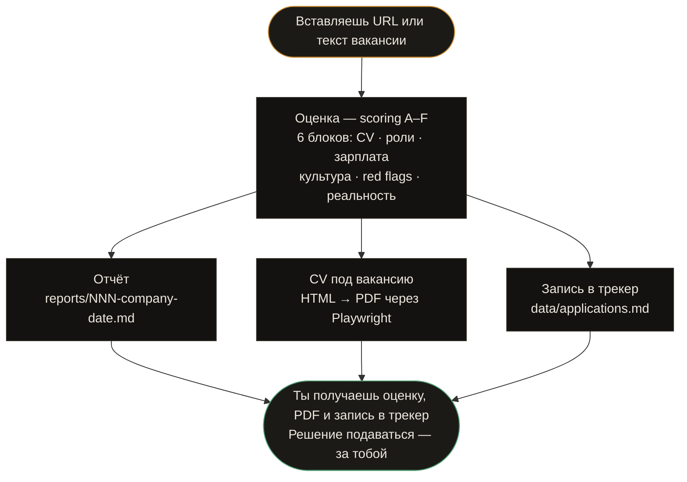

<!--
  ╔═══════════════════════════════════════════════╗
  ║              NAYMI AI  ·  README              ║
  ╚═══════════════════════════════════════════════╝
-->

<div align="center">


# 🤖 Naymi AI

### Персональный AI-рекрутер для украинского рынка труда

*Построен на [Claude Code](https://claude.ai/code) · Работает в вашем терминале*

[](LICENSE)
[](https://nodejs.org)
[](https://playwright.dev)
[](portals.yml)
[](https://claude.ai)

[🇺🇦 Українська](README.md) · [🇷🇺 Русский](#) · [🇬🇧 English](README.en.md)

</div>

---

## Что это такое

**Naymi AI** — агент командной строки, который берёт на себя рутину поиска работы:

- вставил URL вакансии → получил оценку A–F, ATS-оптимизированное CV и запись в трекер
- никаких бесконечных таблиц в Notion, никаких одинаковых резюме для каждой компании
- полный цикл: **скан порталов → оценка → PDF → заявка → follow-up**

Заточен под **Djinni, DOU, Work.ua, Robota.ua**. Документы генерирует на языке вакансии: **🇺🇦 / 🇷🇺 / 🇬🇧**.

> **Принцип:** 5 точных заявок лучше, чем 50 массовых. Система отговаривает от слабых матчей — и усиливает сильные.

---

## Возможности

<table>
<tr>
<td width="50%">

**📋 Оценка вакансий**
Система скоринга 1–5 по 6 блокам: совпадение с CV, роли, зарплата, культура, red flags, реалистичность. Оценка < 4.0 — агент рекомендует не подаваться.

</td>
<td width="50%">

**📄 Генерация CV**
ATS-оптимизированный PDF под конкретную вакансию. Автоматически определяет язык JD — генерирует на украинском, русском или английском.

</td>
</tr>
<tr>
<td>

**🔍 Сканирование порталов**
Zero-token сканер через API Djinni / DOU / Work.ua / Robota.ua. Дедупликация, фильтрация по ключевым словам, только новые вакансии.

</td>
<td>

**📊 Трекер заявок**
Markdown-трекер со статусами: Evaluated → Applied → Interview → Offer / Rejected. Полный аудит-лог каждой заявки.

</td>
</tr>
<tr>
<td>

**🔗 LinkedIn аутрич**
Находит конкретного человека в компании + генерирует персонализированное сообщение. Не шаблон — настоящий LinkedIn power move.

</td>
<td>

**📅 Follow-up кадан**
Автоматически отслеживает когда нужно написать после отправки. Генерирует черновики — коротко, без «просто напоминаю».

</td>
</tr>
<tr>
<td>

**🧠 Анализ отказов**
Выявляет паттерны: какие компании, роли, стек — дают отказы. Позволяет корректировать стратегию на основе данных.

</td>
<td>

**🎯 Подготовка к собеседованию**
STAR+R-сторис, intel по компании, типичные вопросы для роли. Всё в одном файле перед разговором.

</td>
</tr>
</table>

---

## Быстрый старт

```bash
# 1. Клонировать
git clone https://github.com/YOUR_USERNAME/naymi-ai
cd naymi-ai

# 2. Установить зависимости
npm install
npx playwright install chromium

# 3. Запустить Setup Wizard — настроить профиль через браузер
npm run setup

# 4. Открыть в Claude Code или OpenCode
claude .      # или: opencode
```

**Нужно:** [Claude Code](https://claude.ai/code) или [OpenCode](https://opencode.ai) — агент живёт в них.

---

## Веб-настройка

```bash
npm run setup
```

Открывает `http://localhost:3737` — веб-интерфейс для настройки проекта без ручного редактирования YAML:

| Шаг | Что настраивается |
|-----|------------------|
| 1 — Профиль | Имя, email, телефон, город, LinkedIn, заголовок |
| 2 — Роли | Целевые роли, зарплата, формат работы |
| 3 — Язык | Язык агента, язык CV, логика JD output |
| 4 — Порталы | Ключевые слова для сканера вакансий |

Сохраняет прямо в `config/profile.yml` и `portals.yml`.

---

## Как это работает



---

## Команды

```
/ai-recruiter                 → показать меню команд

/ai-recruiter {URL или JD}    → авто-пайплайн (оценка + отчёт + PDF + трекер)
/ai-recruiter pipeline        → обработать очередь URL из data/pipeline.md
/ai-recruiter scan            → найти новые вакансии на порталах
/ai-recruiter tracker         → обзор статуса всех заявок

/ai-recruiter oferta          → только оценка (без PDF)
/ai-recruiter ofertas         → сравнить и ранжировать несколько вакансий
/ai-recruiter pdf             → только PDF, ATS-оптимизированное CV
/ai-recruiter contacto        → LinkedIn аутрич: контакт + сообщение
/ai-recruiter deep            → глубокое исследование компании
/ai-recruiter followup        → трекер follow-up кадана
/ai-recruiter patterns        → анализ паттернов отказов
/ai-recruiter training        → оценить курс или сертификат
/ai-recruiter project         → оценить идею портфолио-проекта
```

---

## Настройка

### 1. Твоё CV

Помести CV в файл `cv.md` в корне — это каноническое источник. Агент читает отсюда при каждой генерации.

Если нет — просто скажи агенту во время onboarding: вставь текст, дай LinkedIn-ссылку, или расскажи об опыте. Агент составит CV сам.

### 2. Профиль

Скопируй `config/profile.example.yml` → `config/profile.yml`:

```yaml
candidate:
  name: "Имя Фамилия"
  email: "email@example.com"
  phone: "+380XXXXXXXXX"
  location: "Киев, Украина"

targets:
  roles:
    - "AI Agent Developer"
    - "AI Solutions Specialist"
  salary:
    min: 1500
    target: 2500
    max: 4000
    currency: "USD"

language:
  agent: "ru"           # язык ответов: uk | ru | en
  cv_default: "uk"      # язык CV по умолчанию
  jd_output: "match_jd" # или "cv_default"
```

### 3. Порталы и ключевые слова

`portals.yml` уже настроен под Djinni, DOU, Work.ua, Robota.ua. Отредактируй ключевые слова под свои роли.

---

## Система оценки

Каждая вакансия получает оценку **1.0–5.0** по шести блокам:

| Блок | Что оценивается |
|:----:|----------------|
| **A** | Совпадение с CV и навыками |
| **B** | Соответствие целевым ролям (North Star) |
| **C** | Зарплата vs рынок |
| **D** | Культура, стабильность, команда |
| **E** | Red flags и блокеры |
| **F** | Общая оценка |
| **G** | Legitimacy — вакансия реальна? *(не влияет на score)* |

| Score | Рекомендация |
|:-----:|-------------|
| **4.5+** | Сильное совпадение — подаваться немедленно |
| **4.0–4.4** | Хорошо — стоит подаваться |
| **3.5–3.9** | Неплохо — но не идеал |
| **< 3.5** | Не рекомендуется |

---

## Структура проекта

```
naymi-ai/
├── cv.md                        # Твоё CV — каноническое источник
├── config/
│   ├── profile.yml              # Твой профиль (создать из .example)
│   └── profile.example.yml      # Шаблон профиля
├── modes/
│   ├── _shared.md               # Системная логика агента
│   ├── _profile.md              # Персонализация: архетипы, скрипты
│   ├── oferta.md                # Режим оценки вакансии
│   ├── pdf.md                   # Генерация CV
│   ├── scan.md                  # Сканирование порталов
│   └── ...                      # Другие режимы
├── templates/
│   └── cv-template.html         # HTML-шаблон CV
├── portals.yml                  # Порталы и ключевые слова
├── data/
│   ├── applications.md          # Трекер заявок
│   ├── pipeline.md              # Inbox — очередь URL
│   └── scan-history.tsv         # Дедуп-журнал сканера
├── output/                      # Сгенерированные PDF  [gitignored]
├── reports/                     # Отчёты оценок        [gitignored]
├── generate-pdf.mjs             # Playwright: HTML → PDF
└── scan.mjs                     # Zero-token сканер порталов
```

---

## Технологический стек

| Компонент | Технология |
|-----------|-----------|
| Runtime | Node.js 18+ (ES modules) |
| PDF генерация | Playwright (Chromium headless) |
| Конфигурация | YAML |
| Данные | Markdown + TSV |
| AI ядро | Claude (через Claude Code / OpenCode) |

---

## Языковая логика

| Настройка | Поведение |
|-----------|-----------|
| `agent: uk` | Агент отвечает на украинском |
| `agent: ru` | Агент отвечает на русском |
| `agent: en` | Agent responds in English |
| `jd_output: match_jd` | CV на языке вакансии (uk / ru / en) |
| `jd_output: cv_default` | CV всегда на языке `cv_default` |

> Технические термины (LLM, RAG, Tool Calling, MCP, HITL, LangGraph, CrewAI) — всегда на английском, независимо от языка документа.

---

## Форк и адаптация

Этот проект — открытый шаблон. Форкни, заполни `cv.md` и `config/profile.yml`, и система готова к работе.

```bash
git clone https://github.com/YOUR_USERNAME/naymi-ai
cd naymi-ai
cp config/profile.example.yml config/profile.yml
# Отредактируй profile.yml под себя
# Открой в Claude Code / OpenCode
```

---

## Лицензия

[MIT](LICENSE) — форкай, адаптируй, используй.

---

<div align="center">

Сделано с ☕ для тех, кто ищет работу умнее — а не больше.

</div>
